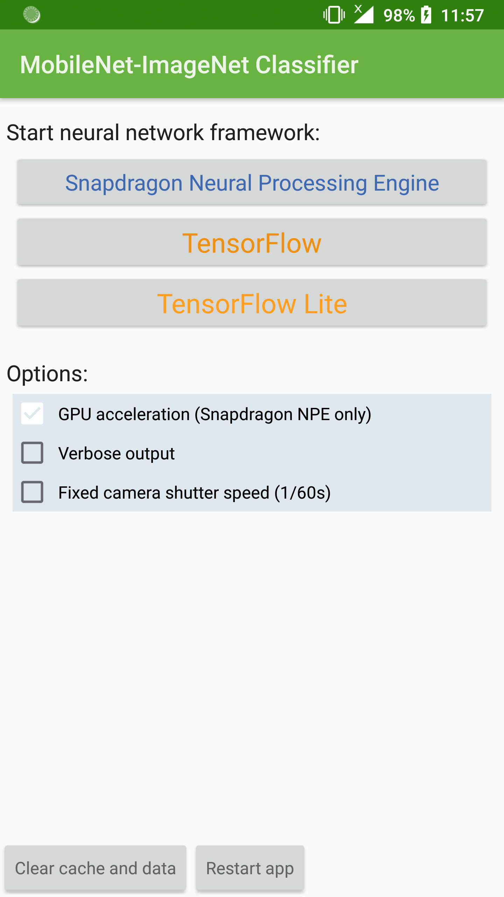
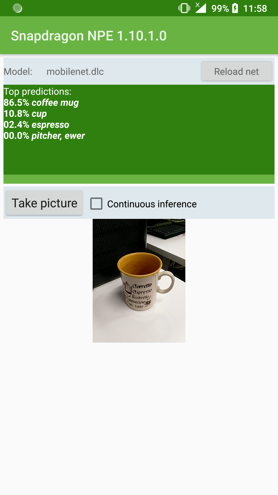
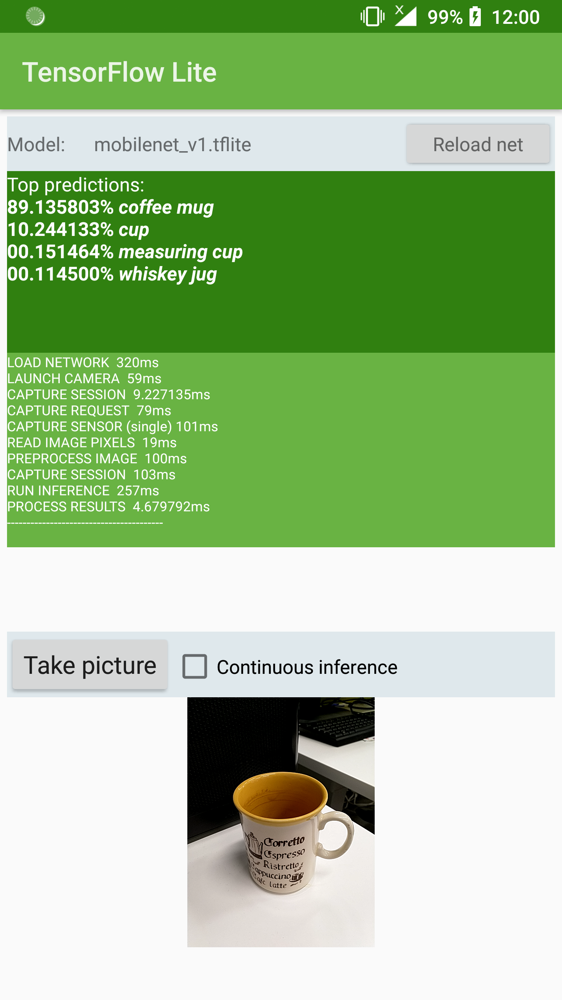
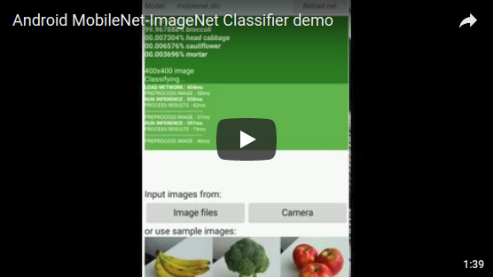

MobileNet-ImageNet Classifier
=============================

A more user-friendly demo version of the Android app that I developed for the experimental measurements of my master's thesis  
[Performance of Neural Network Image Classification on Mobile CPU and GPU](http://sipiseppala.fi/docs/masters_seppala_2018.pdf).

Contact me if you want a prebuilt APK.

### Screenshots

  

### Demo Video

### Frameworks and Models

To reduce repository size and avoid possible license issues, framework libraries and neural net model files are not included.

**Snapdragon NPE** manually downloaded from [Qualcomm website](https://developer.qualcomm.com/software/snapdragon-neural-processing-engine-ai) (requires registration)

**TensorFlow** and **TensorFlow Lite** compiled at build time from [Google's Maven repo](https://bintray.com/google/tensorflow)

**Image Classification models:**
  * [TensorFlow-Slim](https://github.com/tensorflow/models/tree/master/research/slim) -- untrained *Inception V2* and *MobileNet 1.0* were used in my thesis's measurements
  * [TensorFlow Lite models](https://github.com/tensorflow/tensorflow/blob/master/tensorflow/contrib/lite/g3doc/models.md) -- the demo app uses *Mobilenet 1.0 224 Float*
  * [Caffe-Mobilenet](https://github.com/shicai/MobileNet-Caffe) -- for compatibility reasons the demo app uses this for SNPE and TF, conversion back to TF was done with [Caffe-TensorFlow](https://github.com/ethereon/caffe-tensorflow)